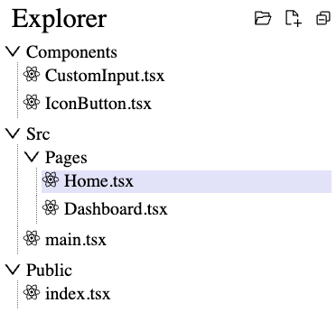

# React File Navigator

## Introduction

React File Navigator allows you to integrate a file system navigator into your React applications. It provides a customizable and interactive hierarchical view of files and folders, complete with icons and configurable actions with drag and drop support.

For queries reachout : workwith.avinashsingh@gmail.com

## Features

- Render a hierarchical tree structure of files and folders.
- Customizable icons for file types and folder states.
- Configurable actions and callbacks for file and folder interaction.
- Easily integrate with modern React applications.
- Drag Drop to rearrange structure.

## Installation

To install the package, run the following command in your project directory:

```bash
npm install react-file-navigator
```

Or if you use Yarn:

```bash
yarn add react-file-navigator
```



## Usage

### Import Components

Import the necessary components and hooks into your React component:

```jsx
import React, { useState } from 'react';
import { IoLogoReact, IoDocumentText } from 'react-icons/io5';
import { DownOutlined, RightOutlined } from '@ant-design/icons';
import { Explorer, IconMap, Tree, TreeNode } from 'react-file-navigator';
```

### Define the File System Structure

Define your initial file system structure using the Tree and TreeNode types:

```tsx
const initialTree: Tree = [
	{
		id: '1',
		type: 'Folder',
		name: 'Root',
		filePath: '/root',
		expanded: true,
		icon: 'folderExpanded',
		children: [
			{
				id: '2',
				type: 'File',
				filePath: '/root/main.tsx',
				extension: 'tsx',
				icon: 'tsx',
				name: 'main.tsx',
			},
		],
	},
];
```

### Set Up the Explorer Component

Use the Explorer component in your application with the defined tree structure:

```tsx
const App: React.FC = () => {
	const [tree, setTree] = useState < Tree > initialTree;

	const handleFileSelectionChange = (selectedNode: TreeNode | null) => {
		console.log('Selected file:', selectedNode);
	};

	const iconMap: IconMap = {
		default: <IoDocumentText />,
		folderCollapsed: <RightOutlined />,
		folderExpanded: <DownOutlined />,
		tsx: <IoLogoReact />,
	};

	return (
		<div style={{ height: '100vh' }}>
			<Explorer
				tree={tree}
				setTree={setTree}
				iconMap={iconMap}
				onFileSelectionChange={handleFileSelectionChange}
				config={{
					accentColor: 'lavender',
					fontColor: 'black',
					label: 'File System',
				}}
			/>
		</div>
	);
};

export default App;
```

## Type Definitions

### Tree

Array of TreeNode objects representing the file system.

### TreeNode

Union type of FileNode and FolderNode, representing individual nodes in the file system.

### FileNode

Represents a file in the tree:

```typescript
interface FileNode {
	id: string;
	type: 'File';
	filePath: string;
	extension: string;
	icon: string;
	name: string;
}
```

### FolderNode

Represents a folder in the tree:

```typescript
interface FolderNode {
	id: string;
	type: 'Folder';
	filePath: string;
	expanded: boolean;
	icon: 'folderCollapsed' | 'folderExpanded';
	name: string;
	children: TreeNode[];
}
```

### IconMap

Object defining the icons used for different file types and folder states:

```typescript
type IconMap = {
	default: React.ReactNode;
	folderCollapsed: React.ReactNode;
	folderExpanded: React.ReactNode;
	[extension: string]: React.ReactNode;
};
```

### ExplorerConfig

Configuration options for customizing the file navigator:

```typescript
interface ExplorerConfig {
	label?: string;
	rename?: 'DoubleClick' | 'Enter' | 'Both';
	delete?: 'Delete' | 'CMD + Backspace' | 'Both';
	fontColor?: string;
	accentColor?: string;
	headerFontSize?: string;
	headerIconSize?: string;
	fontSize?: string;
	iconSize?: string;
	disableActions?: boolean;
}
```
